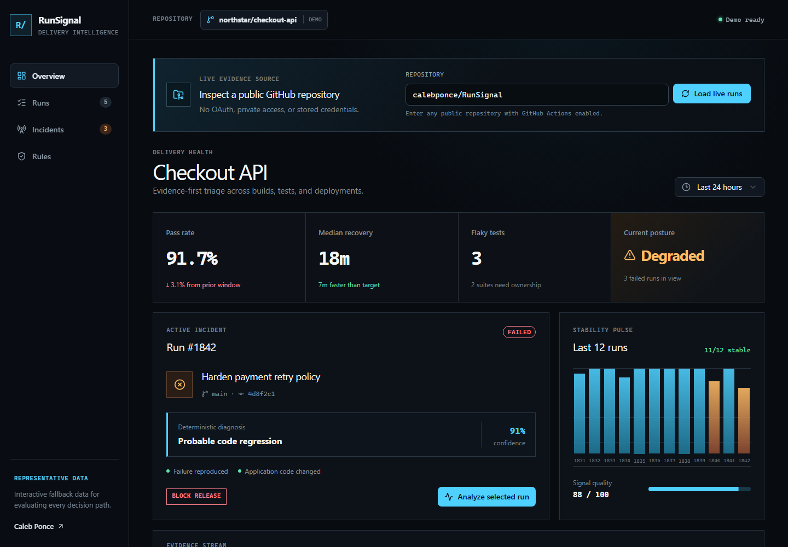
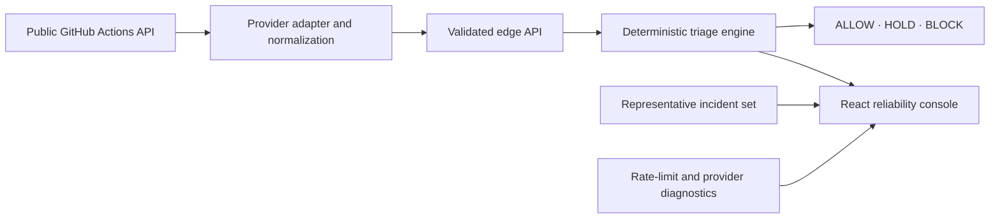

# RunSignal

[](https://github.com/calebponce/RunSignal/actions/workflows/reliability-ci.yml)
[](https://runsignal-caleb.mheaeduardo.chatgpt.site)

**An evidence-first CI reliability console that turns workflow history into explainable release decisions.**

[](https://runsignal-caleb.mheaeduardo.chatgpt.site)

[Live demo](https://runsignal-caleb.mheaeduardo.chatgpt.site) · [Decision engine](lib/triage-engine.ts) · [GitHub adapter](lib/github-actions.ts) · [API route](app/api/github/route.ts) · [Tests](tests) · [Architecture decision](docs/decisions/001-public-github-ingestion.md)

RunSignal answers the question behind every red build: **is this a code regression, a flaky test, runner pressure, or an external dependency—and should the release continue?** It normalizes webhook-shaped signals, scores competing causes with deterministic rules, and returns an inspectable `ALLOW`, `HOLD`, or `BLOCK` decision.

The public experience reads real GitHub Actions history for public repositories without OAuth or stored credentials. A representative incident set remains available when GitHub has no workflow history or its anonymous API limit is exhausted.

## Review it in 60 seconds

1. [Open the live product](https://runsignal-caleb.mheaeduardo.chatgpt.site) and inspect the preloaded failed run.
2. Select **Analyze selected run** to see the evidence, confidence, recommended action, and release policy produced by the server-backed deterministic engine.
3. Open **Policy lab** to adjust the protected-branch action, confidence floor, or retry requirement. The simulator changes only the release gate; it never mutates the diagnosis or evidence scorecard.
4. Enter a public `owner/repository` with GitHub Actions to replace the representative data with live workflow evidence.
5. Trace the implementation from [`GET`/`POST /api/github`](app/api/github/route.ts) through [normalization](lib/github-actions.ts) into the [decision engine](lib/triage-engine.ts).

## Engineering proof

| Capability | Inspectable evidence |
| --- | --- |
| Real public GitHub Actions ingestion | Workflow, job, commit, run-attempt count, queue, and branch metadata normalized in [`lib/github-actions.ts`](lib/github-actions.ts) |
| Explainable release decisions | Pure deterministic scoring and `ALLOW`, `HOLD`, or `BLOCK` policy in [`lib/triage-engine.ts`](lib/triage-engine.ts) |
| Policy simulation without hidden side effects | Typed policy evaluation keeps diagnosis and scorecards stable while a local policy layer previews the release action |
| Defensive provider boundary | Repository and run validation, fixed GitHub API origin, rate-limit handling, and fallback behavior in [`app/api/github/route.ts`](app/api/github/route.ts) |
| Regression protection | Contract coverage for GitHub normalization and incident classification in [`tests/`](tests) |
| Repeatable delivery | Automated test, lint, and production-build checks in [Reliability CI](.github/workflows/reliability-ci.yml) |
| Documented tradeoffs | Credential-free ingestion decision and known constraints in [ADR 001](docs/decisions/001-public-github-ingestion.md) |
| Signed webhook boundary (shadow mode) | HMAC-SHA256 verification over raw request bytes, bounded payloads, delivery metadata validation, and [contract tests](tests/github-webhook.test.ts) |
| Opt-in delivery ledger | [D1 adapter](lib/webhook-delivery-store.ts), generated [SQLite migration](drizzle/0000_steep_tomas.sql), and duplicate/conflict tests; **not enabled in the public demo** |

## Why this project exists

Build dashboards usually report that a run failed. RunSignal focuses on the decision that follows:

- Reproducible failures after application-code changes point toward a regression.
- A verified successful retry plus comparable workflow history can support a flaky-test hypothesis.
- Abnormal runner queues point toward infrastructure pressure.
- Provider health signals can isolate an external dependency incident.
- Protected branches block only when the evidence supports that policy.

The engine stays deterministic. AI may eventually summarize a result, but it cannot change the evidence score or release decision.

## Working product

- Interactive reliability workspace with health metrics and run history.
- Read-only GitHub integration for real public repository, workflow, job, commit, run-attempt count, queue, and branch-protection evidence.
- Selectable runs covering success, regression, flaky-test, infrastructure, and cancellation states.
- Server-side `GET` and `POST /api/github` endpoints with bounded repository and run validation.
- Explicit GitHub API rate-limit, missing-repository, empty-history, and local-fallback states.
- Original `POST /api/analyze` contract remains available for normalized webhook-shaped signals.
- Interactive Policy lab demonstrates how typed release controls change only the final action, never the incident diagnosis or evidence scorecard.
- Pure triage engine shared by the interface and API.
- Graceful browser fallback if the analysis endpoint is unavailable.
- WebMCP action for selecting and analyzing a representative workflow run.
- Responsive layout with keyboard-visible controls and reduced-motion support.

## Deterministic decision flow

1. Normalize outcome, available retry results, comparable workflow history, queue delay, dependency health, changed paths, and branch protection.
2. Score the four competing incident causes.
3. Select the strongest supported verdict and expose every contributing signal.
4. Enforce `ALLOW`, `HOLD`, or `BLOCK` independently of narrative generation.

## Architecture



| Layer | Responsibility |
| --- | --- |
| React + Vinext | Interactive operations console and accessible state transitions |
| GitHub REST adapter | Reads public workflow, job, commit, run-attempt count, queue, and branch metadata without a user token |
| Edge route | Validates webhook-shaped run signals and returns versioned analysis |
| Deterministic engine | Evidence weighting, classification, confidence, severity, and release policy |
| WebMCP | Exposes the same visible analyze-run journey as a structured browser action |
| Node test suite | Locks regression, flaky-test, infrastructure, dependency, success, and inconclusive contracts |
| Cloudflare Workers runtime | Hosts the full-stack application without paid third-party services |

The provider-boundary tradeoffs are documented in [ADR 001: Public GitHub ingestion without credentials](docs/decisions/001-public-github-ingestion.md).

## Run locally

Requirements: Node.js 22.13 or newer.

```bash
npm ci
npm run dev
```

Open `http://localhost:5173`.

### Signed webhook intake preview

The repository includes `POST /api/webhooks/github`. It accepts a GitHub `workflow_run.completed` delivery only when `RUNSIGNAL_GITHUB_WEBHOOK_SECRET` is configured in the running environment. It verifies `X-Hub-Signature-256` against the original request bytes, limits the payload to 1 MiB, validates the delivery ID and run shape, then returns a shadow-mode acknowledgement. Other signed event types are ignored. Missing configuration fails closed. The public demo remains a read-only GitHub browser and has no webhook secret configured.

The public demo still runs in shadow mode: its [hosting configuration](.openai/hosting.json) has `d1: null` and no webhook secret. The repository now includes an opt-in D1 ledger. If a D1 `DB` binding, the generated [`webhook_deliveries` migration](drizzle/0000_steep_tomas.sql), and a webhook secret are explicitly configured, completed-run deliveries record only an ID, body digest, repository, run ID, and receipt time. An identical redelivery returns `duplicate`; a reused ID with different bytes returns `409`. A configured but unavailable store returns `503` instead of silently reverting to shadow mode. This does **not** analyze the run, enforce a release gate, post GitHub Checks, or provide installation-scoped authorization. No D1 binding or webhook secret was provisioned for the public site as part of this project.

The local suite tests duplicate behavior with a D1-shaped in-memory adapter and executes the generated migration in SQLite. It has **not** been integration-tested against a provisioned D1 database. Before operational use, apply the migration to a configured D1 database, exercise GitHub redelivery against a test repository, define retention and out-of-order-event handling, and add authorization and background processing. See the [signed intake decision](docs/decisions/002-signed-webhook-shadow-mode.md).

## Verify

```bash
npm test
npm run lint
npm run build
```

## API example

Load recent runs from a public repository:

```http
GET /api/github?repository=calebponce%2FRunSignal
```

Enrich and analyze one loaded workflow run:

```http
POST /api/github
Content-Type: application/json
```

```json
{
  "repository": "calebponce/RunSignal",
  "runId": 123456789
}
```

The response includes the deterministic analysis plus changed-file, failed-job, failed-step, branch-protection, and rate-limit diagnostics. RunSignal never accepts arbitrary upstream hosts; repository input is normalized into a fixed `api.github.com` request path.

The original normalized-signal contract is also available:

```http
POST /api/analyze
Content-Type: application/json
```

```json
{
  "runId": 1842,
  "outcome": "failure",
  "retryOutcome": "failure",
  "historicalFailureRate": 0.02,
  "queueDelayMinutes": 2,
  "baselineQueueMinutes": 2,
  "dependencyHealth": "healthy",
  "touchedApplicationCode": true,
  "protectedBranch": true
}
```

The response includes the verdict, severity, confidence, release decision, recommended action, ordered evidence, and complete scorecard.

Optionally include a `releasePolicy` object with `protectedBranchRegression`, `blockConfidenceFloor`, and `requireReproducedFailureForBlock` to evaluate a policy override. The API returns its decision reason alongside the unchanged diagnosis and scorecard.

## Ownership

RunSignal was designed and implemented as a solo portfolio project by [Caleb Ponce](https://github.com/calebponce). Reviewers can inspect real public workflows or restore the representative incident set to exercise failure paths that are not present in a healthy repository.

## Current boundaries

- GitHub ingestion is intentionally read-only and limited to public repositories.
- The public GitHub run response exposes an attempt count but not earlier attempt outcomes. The adapter leaves retry outcome unknown and excludes the selected run from its historical workflow failure rate. A code-path change alone cannot block a release under the default policy.
- Anonymous GitHub API rate limits apply; the interface reports the remaining request budget and preserves the demo fallback.
- GitHub Actions does not provide third-party dependency health, so that signal remains neutral unless supplied through the normalized API contract.
- The first release evaluates one normalized run at a time; it does not persist incidents.
- Confidence is a transparent rule score, not a statistical probability.
- Production adoption would add durable event storage, background processing, authenticated private-repository access, and organization-specific policy configuration.
- Signed webhook intake stays in shadow mode on the public demo. An opt-in D1 ledger has local duplicate/conflict tests but is not provisioned, deployed, or validated against live redelivery. Retention, background processing, installation-scoped authorization, and GitHub Checks remain future work.

## License

Released under the MIT License.
